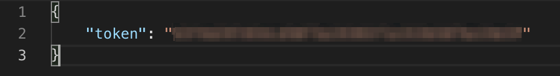
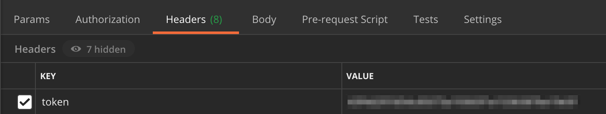
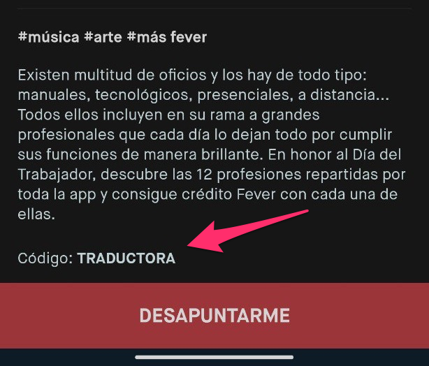
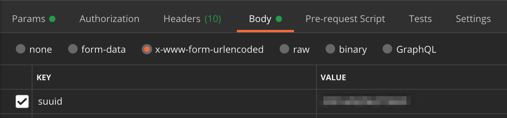

# Unofficial Fever up API

A reverse-engineered implementation of the Fever app API.

## Why I do this

Feverup is a company that gives its customers money every week in exchange for joining free planes and redeeming codes. In this way, you can store a balance and use it in future purchases to go have a beer. The problem with this is that if, for example, they give away 6€, you have to sign up for 12 planes and redeem 12 coupons and since I'm lazy, I prefer to automate this whole process.

## Install
```bash
$ git clone https://github.com/offk0rs/feverup.git
$ cd feverup/server/
$ npm install
$ npm run start
```
## Usage
### Login
Since fever does not have a login method with username and password, it can only be done through google, you must have the phone rooted to access to the login data.
You must go to the folder:
 ```/data/data/com.feverup.fever/shared_prefs```
extract from the file 
```fever_shared_preferences.xml```
which is an xml, the entire LAST_LOGIN_REQUEST property.
The method to login and obtain an access token is as follows
```
POST: localhost:5000/api/googleLogin
```
and you have to add the next values to body request:
```
"google_id":req.body.google_id,
"middle_name":req.body.middle_name,
"client_version":req.body.client_version,
"first_name":req.body.first_name,
"last_name":req.body.last_name,
"birthday":req.body.birthday,
"gender":req.body.gender,
"email":req.body.email,
"avatar_url":req.body.avatar_url,
"suuid":YOU CAN INVENT THIS FIELD
"auth_token":req.body.auth_token,
"client_id":req.body.client_id,
```
and the api will return api token for other requests


### Show available cities
With this request you can see the cities where fever works. This parameter is important for searches, specify in which city you are looking for a specific event.
```
GET: localhost:5000/api/citiesList/:page
For example: localhost:5000/api/citiesList/1
```
For other requests, we will use the city code, for example LON, MAD, etc.
For this request, you need to add your previously generated token and put it in request headers, as follows

### Search by a keyword
With this request you can search events by a keyword
```
GET: localhost:5000/api/search?city=:cityCode&hitsPerPage=:hits&page=:page&query=:keyword
For example: localhost:5000/api/search?city=LON&hitsPerPage=15&page=0&query=free
```
In this request token is no needed

### Get plan information
With this request you get the id, the description and the code of the first available session(this last code its important for redeem codes).
```
GET: localhost:5000/api/getPlanInfo/:planId
For example: localhost:5000/api/getPlanInfo/79595
```
For this request, you need to add your previously generated token and put it in request headers, as follows

### Get available coupons
With this request you can get a list of coupons available in the city you specify.

This request may vary in each city, so it is best to adapt it to each country's.
For example, in Spain, the coupon is followed by the word "Código:", so the api takes the following word, for example:



So depending on the country, this parameter should be adapted depending on how the coupons are. In addition to this, since in the end this is a search for an event, you must choose the keyword used by all events that have coupons. In Spain, for example, the coupon search keyword is "cupones"
```
GET: localhost:5000/api/getCoupons?city=:city&hitsPerPage=:hits&page=:page&query=:keyword&regexWord=:regex:
For example: localhost:5000/api/getCoupons?city=MAD&hitsPerPage=90&page=0&query=cupones&regexWord=Código:
```
In this request token is no needed
Response example:
```
{
    "coupons": {
        "0": {
            "id": 86734,
            "coupon": "CIENTIFICO"
        },
        "1": {
            "id": 86733,
            "coupon": "TRADUCTORA"
        },
        "2": {
            "id": 86732,
            "coupon": "INGENIERO"
        },
        "3": {
            "id": 86731,
            "coupon": "ARQUITECTO"
        },
        "4": {
            "id": 86730,
            "coupon": "PERIODISTA"
        },
        "5": {
            "id": 86729,
            "coupon": "CONDUCTOR"
        },
        "6": {
            "id": 86728,
            "coupon": "ENTRENADORA"
        },
        "7": {
            "id": 86727,
            "coupon": "COCINERO"
        },
        "8": {
            "id": 86726,
            "coupon": "DEPENDIENTE"
        },
        "9": {
            "id": 86725,
            "coupon": "ENFERMERA"
        },
        "10": {
            "id": 86724,
            "coupon": "PANADERO"
        },
        "11": {
            "id": 86702,
            "coupon": "CARTERA"
        }
    }
}
```
### Attend free plan
**Attention** ¡¡This is only for free plans!!
This request allows us to sign up for a plan.
All we need is the id of the session we want to sign up for. To obtain it, we only need to obtain the information of the event as explained above, take the parameter "defaultSession" and finally make the following request
```
GET: localhost:5000/api/attendId/:sessPlan
For example: localhost:5000/api/attendId/4767191
```
For this request, you need to add your previously generated token and put it in request headers, as follows


### Redeem code
With this request we can exchange a coupon obtained before explained. 
The strategy then is, first check for coupons. If there are, we save the ids of the events and obtain the information of those events. 
Once with that information, we save the defaultSession, which we will use to sign up for that plan. 
Once we are signed up, we can already redeem the coupon obtained in the first step.
```
POST: localhost:5000/api/redeem?code=:code
For example: localhost:5000/api/redeem?code=TRADUCTORA
```
For this request, you need to add your previously generated token and put it in request headers, as follows


For this request, you need to add your previously invented suuid and put it in request body, as follows



## Legal

This code is in no way affiliated with, authorized, maintained, sponsored or endorsed by feverup or any of its affiliates or subsidiaries. This is an independent and unofficial API. Use at your own risk.
